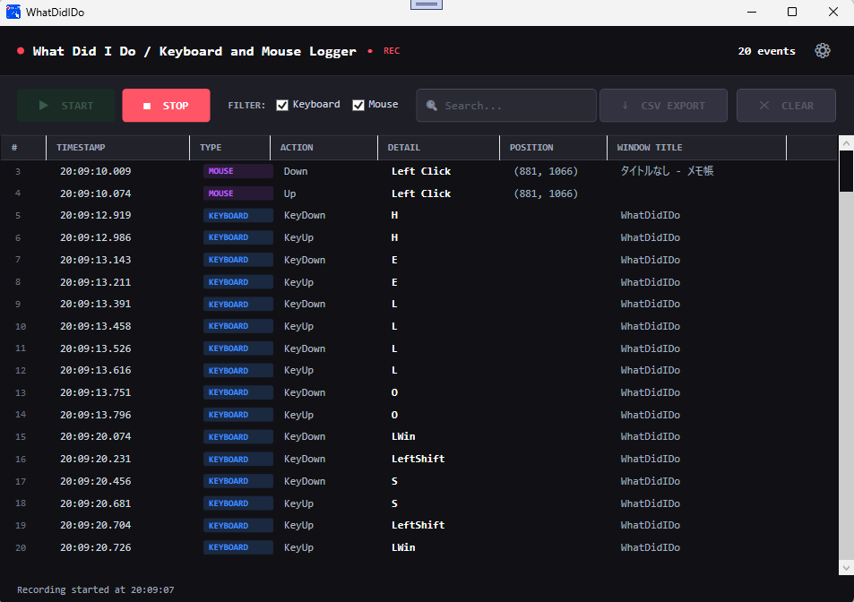

# WhatDidIDo

[](https://opensource.org/licenses/MIT)
[](https://dotnet.microsoft.com/download/dotnet/8.0)

**WhatDidIDo** は、Windows上のあらゆるキーボード入力とマウス操作をリアルタイムに記録し、可視化するためのオープンソースソフトウェアです。

作業ログの記録、操作手順の振り返り、あるいは自分の操作パターンの分析など、エンジニアやクリエイターの「自分が何をしていたか」を可視化するのに最適です。



## 🚀 主な機能

* **グローバル入力フック**: アプリが背面にいても、OS全体のキーボード・マウス操作を検知して記録。
* **リアルタイム・ロギング**: タイムスタンプ、操作種別、詳細内容（キー名、クリック位置等）、アクティブウィンドウタイトルを即座にリスト表示。
* **表示フィルター機能**: キーボードのみ、マウスのみなど、必要に応じて表示するログをリアルタイムに切り替え可能。
* **CSVエクスポート**: 記録したログをBOM付きUTF-8形式のCSVとして保存。Excel等での分析が容易です。
* **各種設定機能 (⚙)**:
  * **START時自動CLEAR**: STARTボタン押下時に既存ログを自動的にクリアして記録開始。
  * **自動停止**: 指定秒数が経過した後に自動的に記録を停止。
  * **上書き記録**: 件数上限を超えた際に古い記録から自動削除。
  * **ブラックリスト**: 指定したACTIONやDETAIL（カンマ区切り指定可能）を記録対象から除外。
  * **自動CSV保存**: 記録停止時に指定フォルダーへ自動でCSVを保存。

## 📋 動作要件

* **OS**: Windows 10 / 11 (64bit推奨)
* **ランタイム**: [.NET 8.0 Desktop Runtime](https://dotnet.microsoft.com/download/dotnet/8.0)
* **権限**: グローバル入力をフックするため、環境によってはセキュリティソフトの許可や管理者権限が必要な場合があります。

## ⚠️ セキュリティ・使用上の注意

* **機密情報の入力**: 本ソフトは起動中、**すべてのキーボード入力を記録します**。パスワード、クレジットカード番号、個人情報などの機密情報を入力する際は、必ず記録を停止するか、ソフトを終了してください。
* **データの取扱い**: 記録されたログはメモリ上に保持され、CSV出力を行わない限りファイルとして保存されることはありません。また、外部サーバーへデータを送信する機能は一切含まれていません。
* **自己責任**: 本ソフトの使用によって生じたあらゆる損害について、制作者は一切の責任を負いません。

## 🛠 使い方

1. `WhatDidIDo.exe` を実行します。
2. 「記録開始」ボタン（緑色）をクリックすると、入力を検知し始めます。
3. 画面上のリストに、あなたの操作が次々と記録されていきます。
4. 記録を止めたいときは「停止」ボタン（赤色）をクリックしてください。
5. 「CSV出力」ボタンを押すと、記録されたログをファイルに保存できます。

## 📦 インストール / 開発

 ### インストール方法

1. 以下のリンクから `WhatDidIDo.zip` をダウンロードします。

   [WhatDidIDo.zip をダウンロード](https://github.com/OtabiHirohito/WhatDidIDo/releases)

2. ダウンロードしたZIPファイルを任意の場所に展開します。
3. 展開したフォルダー内の `WhatDidIDo.exe` を実行します。

 ### ビルド方法

1. [Visual Studio 2022](https://visualstudio.microsoft.com/ja/vs/) または [.NET 8 SDK](https://dotnet.microsoft.com/download/dotnet/8.0) をインストールします。
2. リポジトリをクローンします。

   ```bash
   git clone https://github.com/OtabiHirohito/WhatDidIDo.git
   ```

3. ソリューションファイル `WhatDidIDo.sln` を開いてビルドするか、コマンドラインで以下を実行します。

   ```bash
   dotnet build
   ```

## 🤝 寄付について

   このソフトを気に入っていただけた場合は、よろしければ以下の寄付先への支援をご検討ください。
<sub>本ソフトおよび制作者はリンク先の組織とは一切関係がございません。</sub>

* [寄付先1](https://www.ccaj-found.or.jp/forms/creditonce/ "がんの子どもを守る会")
* [寄付先2](https://congrant.com/project/peacewinds/13361/form/step1?item_id=2698383&_gl=1*c9kt5v*_gcl_au*MTg4MzkxNDY5NC4xNzg3NDIzNTE1*FPAU*MTg4MzkxNDY5NC4xNzg3NDIzNTE1*_ga*NzY1NTc4MTcwLjE3ODc0MjM1MTU.*_fplc*R24xZjRlQ1ElMkZQVFJ4ZzJHR1hselp2cUhKZldEbEp1bXElMkZsdUU5eTBLOVQ4cmNDQW5UR3BzNml3bkluMTRLRVplM3RuV2FVYlBoR1R3JTJCSGFlaHBkQ2FZc1AzSHF1JTJGWDJONlVybUxFQ1B6WnAlMkY2UmhXNUV2bDYxQlhCcVZ4dyUzRCUzRA.. "ピースニャンコ")

## 📄 ライセンス

  このプロジェクトは **MITライセンス** のもとで公開されています。詳細は [LICENSE.txt](LICENSE.txt) をご覧ください。

  ---

  Created by 大度寛仁 / X (Twitter): [@OtabiHirohito](https://x.com/OtabiHirohito)
